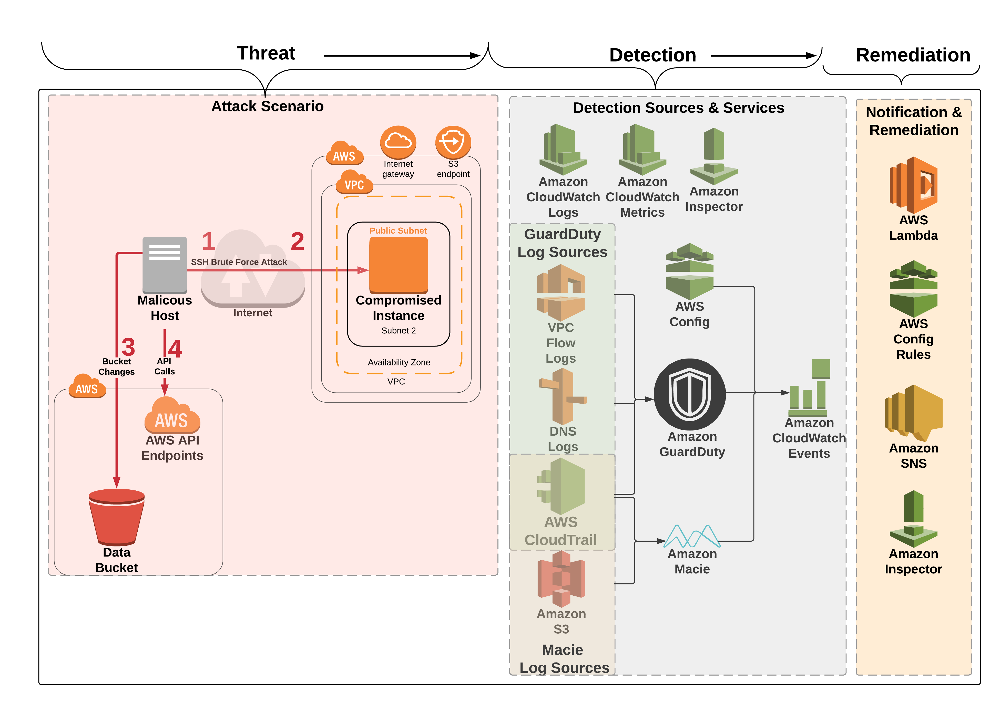

# Module 2: Attack Simulation

Now that you have all the detective controls setup and some automated remediations, you'll be running another CloudFormation template which will simulate a variety of findings.

### Agenda

1. Run the 2nd CloudFormation template – 5 min
2. Threat Detection & Remediation Introduction Presentation – 25 min

## Deploy the CloudFormation Template

To initiate the attack simulation you will need to run the module 2 CloudFormation template: 

Region| Launch
------|-----
US West 2 (Oregon) | 

### Launch Instructions

1. Click the **Launch Stack** button above.  This will automatically take you to the console to run the template.  The file for the CloudFormation template (**01-environment-setup.yml**) is also available in the [templates](../templates/) folder if you'd like to download it and manually upload it to create a stack.
2. The name of the stack will be automatically populated but you are free to change it, after which click **Next**, then **Next** again (leave everything on this page at the default).  
3. Finally, acknowledge the template will create IAM roles and click **Create**

This will bring you back to the CloudFormation console. You can refresh the page to see the stack starting to create. Before moving on, make sure the stack is in a **CREATE_COMPLETE** status as shown below.

### Threat Detection and Remediation Presentation

Here is the diagram of the setup after the module 2 CloudFormation stack is created:

After the presentation, you can proceed to the next module: **[Module 3 - Investigate and Remediate](../docs/02-attack-simulation.md)**.
